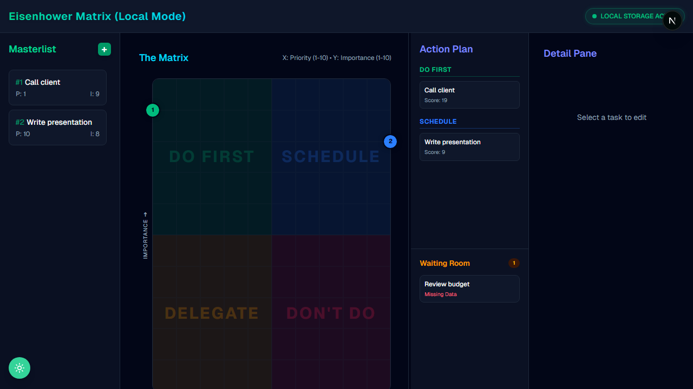

# Eisenhower Tasks

[](https://nextjs.org/)
[](https://www.prisma.io/)
[](https://tailwindcss.com/)
[](https://www.docker.com/)

Een krachtige, zelfgehoste Task Manager gebaseerd op het befaamde **Eisenhower Matrix** principe. Beheer je prioriteiten moeiteloos door taken te categoriseren op basis van urgentie en belangrijkheid, compleet met een intuïtieve Drag & Drop interface en veilige Microsoft-authenticatie.

---

## Preview



---

## Features

- **Eisenhower Matrix:** Visuele weergave van je prioriteiten in de vier bekende kwadranten (Do, Schedule, Delegate, Ignore).
- **Drag & Drop:** Sleep je taken razendsnel tussen de verschillende kwadranten met soepele animaties dankzij `@dnd-kit`.
- **Veilige Authenticatie:** Integratie integratie (MSAL) voor naadloos en veilig inloggen.
- **Lokale Database:** Razendsnelle, zero-config opslag via SQLite en de Prisma ORM.
- **Modern Design:** Prachtige, responsive interface gebouwd met Tailwind CSS en Lucide Icons.

---

## Lokale Installatie (Development)

Wil je de code bewerken? Volg dan deze stappen:

1. **Installeer afhankelijkheden:**
   ```bash
   npm install
   ```

2. **Database voorbereiden:**
   Zorg dat .env correct is ingesteld. Genereer daarna de Prisma client:
   ```bash
   npx prisma generate
   npx prisma db push
   ```

3. **Start de ontwikkelomgeving:**
   ```bash
   npm run dev
   ```
   Open [http://localhost:3000](http://localhost:3000) in je browser om het resultaat te zien.

---

## Installatie op Thuisserver (Proxmox / Portainer)

Deze applicatie is volledig geoptimaliseerd voor productiegebruik via Docker. De ingebouwde Next.js `standalone` build zorgt voor een extreem lichte en snelle container.

1. Open **Portainer** op je thuisnetwerk.
2. Ga naar **Stacks** en klik rechtsboven op **Add stack**.
3. Kies onder Build method voor **Repository**.
4. Vul bij Repository URL deze link in: 
   `https://github.com/DeRoelO/jubilant-fishstick.git` 
5. (Optioneel): Voeg extra Environment variables (.env instellingen) toe onderin Portainer als dat nodig is.
6. Klik op **Deploy the stack**. 

Klaar! Portainer zal de broncode downloaden, de image compileren en de database map veilig opslaan in je LXC container (`/prisma_data`). De app draait vervolgens achter de schermen op poort `3000`.

---
*Gemaakt en beheerd door [DeRoelO](https://github.com/DeRoelO)*
